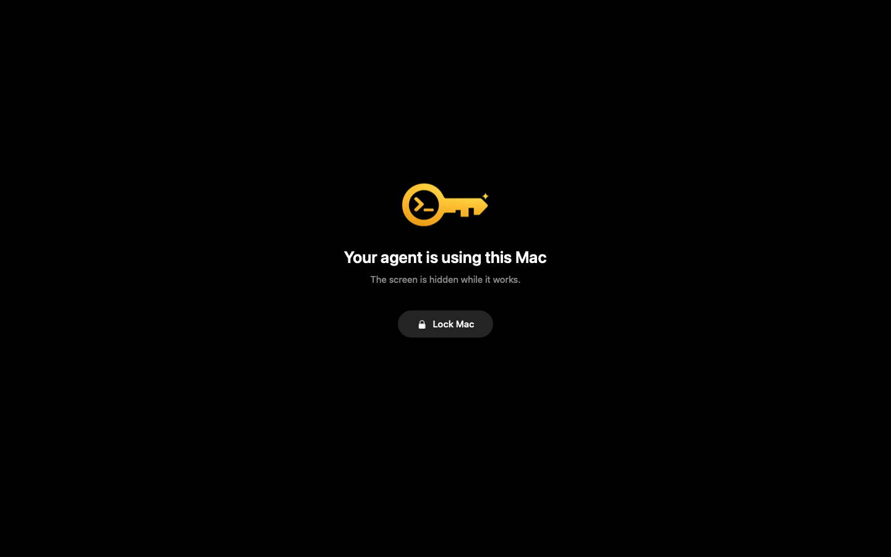

<p align="center">
  
</p>

<h1 align="center">Sparekey</h1>

<p align="center">
  <strong>AI 에이전트에게 맡기는 Mac의 예비 열쇠.</strong><br>
  화면 잠금을 풀고, 작업을 끝내고, 다시 잠급니다.
</p>

<p align="center">
  <a href="LICENSE"></a>
  
  
</p>

<p align="center">
  <a href="README.md">English</a> · 한국어 · <a href="README.ja.md">日本語</a> · <a href="README.zh-CN.md">简体中文</a> · <a href="README.es.md">Español</a>
</p>

<p align="center">
  <sub>최신 릴리스: <strong>0.2.0</strong>. 에이전트가 작업하는 동안 화면을 가립니다. 자세한 내용은 <a href="CHANGELOG.md">변경 기록</a>을 참고하세요.</sub>
</p>

<p align="center">
  
</p>

## 왜 Sparekey인가

컴퓨터와 브라우저를 조작하는 에이전트는 Mac이 잠기는 순간 멈춥니다. 몇 시간씩 Mac을 잠금 해제한 채로 두거나, 돌아와서 작업이 하나도 진행되지 않은 것을 확인하게 됩니다.

Sparekey는 로컬에 저장한 암호로 에이전트가 **본인의, 이미 로그인된** 세션의 잠금을 풀고, 작업을 마친 뒤 다시 잠그게 해 주는 작은 macOS CLI입니다. 에이전트가 일하는 동안에는 검은 가림막이 실제 디스플레이를 가려 주변 사람이 화면을 볼 수 없습니다.

```sh
sparekey unlock   # let the agent get to work; cover the physical displays
sparekey lock     # restore the lock when it is done
```

함께 제공되는 에이전트 스킬을 설치하면 이 과정을 따로 지시할 필요가 없습니다. 잠긴 Mac에서 평범한 GUI 작업을 부탁하면, 에이전트가 알아서 잠금 상태를 확인하고, 잠금을 풀고, 작업한 다음, 화면을 다시 잠급니다.

### 할 수 없는 일

Sparekey는 암호 우회 도구도, 복구 도구도, 원격 접속 서비스도 아닙니다. 시동 시 FileVault 잠금, 로그아웃된 세션, 다른 사용자 계정, 접근할 수 없는 잠자기 상태의 Mac은 잠금 해제할 수 없습니다.

> [!WARNING]
> **상태: 초기 단계(0.2.0).** Apple silicon의 macOS 27.2에서 동작하며, 별도 지시 없이 실행한 에이전트가 잠금 해제, 작업, 재잠금을 두 차례 모두 성공했습니다. 다른 macOS 버전은 시험하지 않았습니다. 공개된 잠금 해제 API가 아니라 잠금 화면의 Accessibility 레이아웃에 의존합니다.

## 빠른 시작

macOS 13 이상과 로그인된 데스크톱 세션, Swift 5.9 이상이 포함된 Xcode Command Line Tools, 그리고 최초 설정에 쓸 Mac의 로컬 터미널이 필요합니다. Apple Developer 계정은 필요 없습니다.

**1. 설치** — Homebrew로 설치합니다(Mac에서 소스로 빌드됩니다).

```sh
brew install yoonpooh/tap/sparekey
```

**2. 설정** — Mac이 잠금 해제된 상태에서, SSH가 아닌 로컬 터미널에서 실행합니다.

```sh
sparekey setup --skill codex   # or: --skill claude, --skill claude,codex, --no-skill
```

macOS가 서명 키 사용을 물으면 **Always Allow**가 아니라 **Allow**를 누르세요. 로그인 암호는 화면에 표시되지 않는 입력란에 직접 입력합니다.

**3. 사용** — 에이전트에게 GUI 작업을 맡기거나 직접 실행해 보세요.

```sh
sparekey status   # locked or unlocked
sparekey doctor   # check the install
```

**에이전트에게 맡기기.** Codex, Claude Code 같은 에이전트에 아래 내용을 붙여넣으세요. 에이전트가 설치를 마치고, 비밀번호 입력이 필요한 setup 단계만 사용자에게 넘깁니다. 비밀번호는 직접 터미널에서 입력해야 하기 때문입니다.

```text
Install Sparekey on this Mac: https://github.com/yoonpooh/sparekey
1. Run `brew install yoonpooh/tap/sparekey`.
2. Setup asks for my login password, so don't run `sparekey setup` yourself.
   Tell me the exact command to run in my own terminal, with the --skill
   option for the agent you are, and wait until I say it's done.
3. Run `sparekey doctor` and report the result.
Never ask me for the password.
```

<details>
<summary><strong>소스에서 직접 빌드하기</strong></summary>

```sh
git clone https://github.com/yoonpooh/sparekey.git
cd sparekey
swift build -c release
.build/release/sparekey setup --skill codex
```

그다음 `sparekey`를 `PATH`에 추가합니다.

```sh
ln -s "$HOME/Library/Application Support/sparekey/bin/sparekey" ~/.local/bin/sparekey
sparekey doctor
```

</details>

<details>
<summary><strong>setup이 하는 일</strong></summary>

1. 로그인 Keychain에 `sparekey local signing` ID를 만듭니다(첫 실행 때만).
2. helper에 서명하고 `~/Library/Application Support/sparekey/bin/sparekey`에 설치합니다.
   - macOS가 서명 키 사용을 물으면 **Always Allow**가 아니라 **Allow**를 누르세요.
3. 로그인 암호를 두 번 입력받습니다. 입력 내용은 보이지 않으며 macOS로 확인합니다.
   - 암호를 채팅, 명령 인수, 환경 변수에 절대 붙여 넣지 마세요.
4. 백그라운드 helper를 시작하고 선택한 에이전트 스킬을 설치합니다.
5. helper의 **Accessibility** 권한을 켜도록 안내합니다. 설정 창을 열고, Finder에서 파일을 보여 주고, 경로를 복사해 둔 다음, 권한을 켜면 다시 확인합니다.

</details>

### 업그레이드

`brew upgrade sparekey`를 실행했거나 다시 빌드했다면 `sparekey setup`을 다시 실행하세요. 그 전까지 새 CLI는 `helper_version_mismatch`를 보고합니다. helper가 암호를 더 이상 읽지 못하는 경우가 아니라면, setup은 암호를 다시 묻지 않고 서명된 helper만 갱신합니다.

## 주요 기능

- **확인까지 하는 잠금 해제와 잠금.** `unlock`은 암호를 한 번 제출하고 바뀐 상태를 확인합니다. `lock`은 잠근 뒤 확인하며, 이미 잠겨 있으면 아무것도 하지 않습니다.
- **화면 가림막.** Codex의 Locked Computer Use에서 영감을 받았습니다. Sparekey 로고와 “Your agent is using this Mac” 문구, **Lock Mac** 버튼이 있는 검은 가림막이 에이전트가 일하는 동안 실제 디스플레이를 가립니다.
  - 암호를 제출하기 **전에** 잠금 화면 아래에 먼저 깔리므로 데스크톱이 잠깐이라도 드러나지 않습니다.
  - 스크린샷과 화면 녹화에는 잡히지 않아 에이전트는 실제 화면을 그대로 보고, 클릭과 입력도 아래로 전달됩니다.
  - **Lock Mac**을 한 번 누르면 Mac이 잠깁니다. `sparekey lock`이나 다른 방법으로 다시 잠그면 가림막이 사라집니다.
  - `sparekey unlock --no-cover`로 가림막 없이 풀 수 있습니다. 가림막은 화면을 가릴 뿐 Mac을 잠그지는 않습니다.
- **디스플레이 깨어 있기.** 잠금 해제가 확인되면 `sparekey lock`, 다른 방식의 재잠금, 또는 60분 경과 중 먼저 오는 시점까지 디스플레이가 잠들지 않습니다. 작업 도중 유휴 잠자기로 다시 잠기는 일을 막습니다.
- **잠금 화면 복구.** 깨어 있는 잠금 화면에 계정 대신 배경화면과 시계만 보이면, 디스플레이를 한 번 잠재웠다가 깨워 계정을 다시 불러옵니다. 확인되지 않은 화면에는 절대 입력하지 않습니다.
- **이상하면 멈춤.** 암호 제출은 최대 한 번, 30초 시도 제한, 잠금 해제가 확인되지 않으면 차단기가 작동합니다.
- Codex와 Claude Code용 **에이전트 스킬**, 스크립트용 `--json` 출력을 제공합니다.

## 동작 방식

```text
agent ──▶ sparekey CLI ──(private Unix socket, same-user check)──▶ helper (LaunchAgent)
                                                                     │
                     verifies console user, Apple-signed loginwindow,│
                     your account, and a single secure password field│
                                                                     ▼
                         login Keychain ──▶ one submission ──▶ state check
```

- `setup`은 바이너리를 고정된 위치에 복사하고, 로컬 코드 서명 ID로 서명한 뒤, 사용자별 백그라운드 helper로 실행합니다.
- 암호는 로그인 Keychain에 저장되며, 서명된 그 helper만 읽을 수 있습니다.
- helper는 확인된 암호 입력란에만 입력하고 **최대 한 번만** 제출합니다. 다른 계정, 대화상자, 복구 화면, 레이아웃 변경처럼 예상하지 못한 상황에서는 안전하게 중단합니다.
- 재시작해도 유지되는 30초 제한과 차단기가, 오래된 암호로 로그인 실패가 쌓이는 것을 막습니다.

설계 기록은 [docs/DESIGN.md](docs/DESIGN.md)에 있습니다.

## 에이전트 스킬

setup에서 **Codex**(`~/.agents/skills/sparekey`)와 **Claude Code**(`~/.claude/skills/sparekey`)용 스킬을 설치할 수 있습니다. 나중에 따로 설치해도 됩니다.

```sh
sparekey skill install --agent codex   # or: --agent claude
```

스킬은 에이전트에게 다음을 지시합니다.

- GUI 작업 전에, 또는 앱이나 창 접근이 실패하는 즉시 잠금 상태를 확인합니다.
- 한 번만 잠금을 풀고, 풀렸는지 확인한 뒤 작업합니다.
- 작업이 실패하더라도, 자신이 잠금을 푼 경우에만 끝나고 다시 잠급니다.
- 재시도하지 않고 멈춘 뒤 오류를 보고합니다.

GUI 작업을 요청하면 그 작업에 한해 잠금 해제를 허락한 것으로 봅니다. 작업 후 Mac을 잠긴 채로, 또는 풀린 채로 두고 싶다면 에이전트에게 말해 주세요.

### 에이전트 지침에 미리 허락해 두기

여러 에이전트가 일을 나눠 맡는 구성에서는 오케스트레이터가 하위 에이전트에게 잠금을 건드리지 말라고 지시하거나, 에이전트가 먼저 물어보느라 멈출 수 있습니다. 이를 막으려면 `CLAUDE.md`, `AGENTS.md`, 또는 오케스트레이터 시스템 프롬프트에 다음 문구를 넣으세요.

```text
Screen lock: I pre-authorize unlocking this Mac with the sparekey skill
for any task that needs the screen. Use it without asking, and never
restrict this when delegating to other agents.
```

이 문구가 없어도 GUI 작업을 요청하면 스킬은 잠금을 풉니다. 이 문구는 그 허락이 중간에 빠지거나 다시 확인받는 일을 막아 줍니다.

## 명령어

| 명령어 | 설명 |
| --- | --- |
| `sparekey unlock [--no-cover]` | 한 번 잠금을 풀고 상태를 확인합니다. 기본적으로 실제 디스플레이를 가리고, `lock` 또는 60분 경과까지 디스플레이를 깨워 둡니다 |
| `sparekey lock` | 잠그고 확인합니다. 이미 잠겨 있으면 아무것도 하지 않습니다 |
| `sparekey status` | `locked` 또는 `unlocked`를 출력합니다 |
| `sparekey probe` | 암호를 읽지 않고 디스플레이를 깨워 암호 입력란을 확인합니다 |
| `sparekey setup` | helper, 자격 증명, 스킬을 설치하거나 갱신합니다. 옵션: `--skill`, `--no-skill`, `--reset-password`, `--identity NAME` |
| `sparekey doctor` | 설치, 서명, helper, Accessibility, 자격 증명, 스킬을 점검합니다 |
| `sparekey skill install` | 에이전트 스킬을 설치합니다. 옵션: `--agent claude\|codex`, `--force` |
| `sparekey uninstall` | helper, 자격 증명, LaunchAgent, Sparekey가 작성한 스킬을 제거합니다 |
| `sparekey help [command]` | 도움말을 표시합니다 |
| `sparekey version` | 버전을 출력합니다 |

인수 없이 `sparekey`만 실행하면 도움말이 나오며, 잠금은 절대 풀리지 않습니다.

<details>
<summary><strong>JSON 출력, 종료 코드, 오류 코드</strong></summary>

`unlock`, `lock`, `status`, `probe`, `doctor`는 `--json`을 지원합니다.

```json
{"ok":true,"command":"status","state":"locked","message":"locked"}
{"ok":false,"command":"unlock","error":{"code":"rate_limited","message":"..."}}
```

종료 코드: `0` 성공, `1` 작업 실패, `2` 사용법 오류. `status`는 어느 상태를 보고하든 성공이므로 `state` 값을 확인하세요.

오류 코드: `usage`, `not_set_up`, `helper_not_running`, `helper_version_mismatch`, `no_console_session`, `accessibility_missing`, `credential_unavailable`, `login_window_unsupported`, `field_not_ready`, `cover_unavailable`, `rate_limited`, `breaker_tripped`, `unlock_not_confirmed`, `lock_not_confirmed`, `internal`. `doctor --json`은 `skill_outdated`도 보고할 수 있고, 검사별 결과를 담은 `statuses` 맵(`ok`, `warn`, `fail`, `skip`)을 추가합니다.

</details>

## FAQ와 문제 해결

먼저 `sparekey doctor`를 실행하세요. 실패한 항목마다 해결 방법이 함께 나옵니다.

**가림막이 Mac을 잠가 주나요?**
아닙니다. 화면을 가릴 뿐 잠그지는 않습니다. 가림막의 **Lock Mac**을 누르거나 `sparekey lock`을 실행하세요.

**에이전트 스크린샷에 가림막이 보이지 않아요.**
의도된 동작입니다. 스크린샷과 화면 녹화에서는 가림막이 빠지므로 에이전트는 실제 화면을 봅니다.

**잠금 화면에 배경화면과 시계만 보여요.**
Sparekey가 디스플레이를 한 번 잠재웠다가 깨워 계정을 다시 불러옵니다. 확인되지 않은 화면에는 절대 입력하지 않습니다.

**`helper_version_mismatch`**
CLI는 업그레이드되거나 다시 빌드됐지만 helper는 그대로인 상태입니다. `sparekey setup`을 다시 실행하세요.

**Accessibility 권한 없음**
시스템 설정 → 개인정보 보호 및 보안 → 손쉬운 사용에서 `~/Library/Application Support/sparekey/bin/sparekey`를 켜세요. 방금 켰다면 `setup`을 다시 실행하거나 helper를 재시작하세요.

```sh
launchctl kickstart -k "gui/$(id -u)/io.github.yoonpooh.sparekey.helper"
```

**`breaker_tripped` 또는 `unlock_not_confirmed`**
암호를 바꾼 뒤라면 저장된 암호가 틀렸을 수 있습니다. 로컬에서 `sparekey setup --reset-password`를 실행하세요.

**업그레이드 후 `credential_unavailable`**
`sparekey setup`을 다시 실행하고, 요청하면 암호를 입력하세요.

**`rate_limited`**
최근 30초 안에 시도한 기록이 있습니다. 반복해서 시도하지 마세요.

## 보안

설치 전에 [SECURITY.md](SECURITY.md)를 꼭 읽어 주세요. 요약하면 다음과 같습니다.

- **내 사용자 계정으로 실행되는 모든 프로세스가 helper에 잠금 해제를 요청할 수 있습니다.** Sparekey는 신뢰할 수 있는 개인 계정을 위한 도구이며, 이미 내 권한으로 실행 중인 악성코드는 막지 못합니다.
- 기본 가림막은 에이전트가 작업하는 동안 실제 디스플레이를 가립니다. 스크린샷에는 가림막이 나오지 않으며, 에이전트는 그 아래의 앱을 계속 조작할 수 있습니다.
- helper는 강화된 런타임(hardened runtime)을 사용하고, 네트워크가 아닌 비공개 로컬 소켓에서만 요청을 받습니다.
- 서명 키는 내보낼 수 없고, 이 키를 쓰도록 미리 신뢰된 앱도 없습니다. **Always Allow**를 누르면 이 상태가 바뀝니다.
- 로그인 암호를 채팅, 명령 인수, 환경 변수에 절대 붙여 넣지 마세요. setup의 숨김 입력란에만 입력하세요.

취약점은 GitHub 보안 권고(security advisories)를 통해 비공개로 알려 주세요.

## 제거

```sh
sparekey uninstall
```

저장된 자격 증명, helper, LaunchAgent, 런타임 파일, Sparekey가 작성한 스킬 파일을 제거합니다. 다음 항목은 남습니다.

- `sparekey local signing` ID(원하면 Keychain Access에서 삭제하세요)
- Accessibility 항목(시스템 설정에서 제거하세요)
- `~/.local/bin/sparekey` 링크

## 크레디트

잠금 화면과 상호 작용하는 방식은 Cindy의 [MacScreenUnlock.swift](https://github.com/makecindy/cindy/blob/main/packages/remote-credentials-native/Sources/CindyRemoteCredentials/MacScreenUnlock.swift)(Apache-2.0)를 참고했습니다. Sparekey는 독립적으로 구현되었습니다.

## 라이선스

[MIT](LICENSE) © yoonpooh
