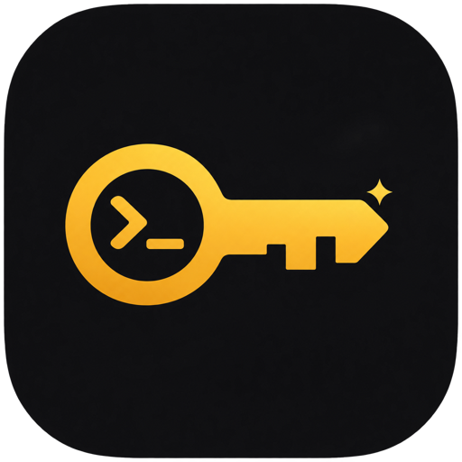

<p align="center">
  
</p>

<h1 align="center">Sparekey</h1>

<p align="center">
  <strong>A spare key to your Mac, for your AI agent.</strong><br>
  Unlock the screen, get the work done, lock it again.
</p>

<p align="center">
  <a href="LICENSE"></a>
  
  
</p>

---

Computer-use and browser-use agents stall the moment your Mac locks. Sparekey is a small macOS CLI that lets an agent unlock **your own, already logged-in** session with a password you saved locally, finish its task, and restore the lock.

```sh
sparekey unlock   # let the agent get to work
sparekey lock     # restore the lock when it is done
```

With the bundled agent skill, you don't have to mention any of this. Ask your agent for an ordinary GUI task on a locked Mac, and it checks the lock, unlocks, does the work, and locks the screen again on its own.

> **Status:** early (0.1). It works on macOS 27.2 on Apple silicon, where two unprompted agent runs unlocked, worked, and relocked successfully. Other macOS versions are untested. It depends on the lock screen's Accessibility layout, not a public unlock API.

## What it is not

Sparekey is not a password bypass, recovery tool, or remote-access service. It cannot unlock FileVault at startup, a logged-out session, another user's account, or a sleeping Mac that is unreachable.

## How it works

```text
agent ──▶ sparekey CLI ──(private Unix socket, same-user check)──▶ helper (LaunchAgent)
                                                                     │
                     verifies console user, Apple-signed loginwindow,│
                     your account, and a single secure password field│
                                                                     ▼
                         login Keychain ──▶ one submission ──▶ state check
```

- `setup` copies the binary to a fixed location, signs it with a local code-signing identity, and runs it as a per-user background helper.
- The password lives in your login Keychain. Only that signed helper is allowed to read it.
- The helper fills only a verified password field, submits **at most once**, and fails closed on anything unexpected: other accounts, dialogs, recovery screens, or layout changes.
- A persistent 30-second limiter and a circuit breaker stop a stale password from piling up failed logins.

## Requirements

- macOS 13 or later with a logged-in desktop session
- Xcode Command Line Tools with Swift 5.9 or newer
- A local terminal on the Mac for the one-time setup

No Apple Developer account is needed.

## Install

Build from source. A Homebrew tap is planned.

```sh
git clone https://github.com/yoonpooh/sparekey.git
cd sparekey
swift build -c release
.build/release/sparekey setup --skill codex   # or: --skill claude, --skill claude,codex, --no-skill
```

Run setup in a local terminal while the Mac is unlocked, not over SSH. It will:

1. Create a `sparekey local signing` identity in your login Keychain (first run only).
2. Sign and install the helper at `~/Library/Application Support/sparekey/bin/sparekey`.
   - When macOS asks to use the signing key, click **Allow**, not **Always Allow**.
3. Ask for your login password twice. Input is hidden and checked against macOS.
   - Never paste it into chat, a command argument, or an environment variable.
4. Start the background helper and install the agent skill you chose.
5. Help you turn on **Accessibility** for the helper. It opens the settings pane, shows the file in Finder, and copies its path, then checks again after you enable it.

Then put `sparekey` on your `PATH`:

```sh
ln -s "$HOME/Library/Application Support/sparekey/bin/sparekey" ~/.local/bin/sparekey
sparekey doctor
```

After pulling a new version, rebuild and run `setup` again. It refreshes the signed helper without asking for the password, unless the helper can no longer read it.

## Agent skills

Setup can install a skill for **Codex** (`~/.agents/skills/sparekey`) and **Claude Code** (`~/.claude/skills/sparekey`). You can also install it later:

```sh
sparekey skill install --agent codex
```

The skill tells the agent to:

- check the lock state before GUI work, or as soon as app or window access fails;
- unlock once, verify it, and do the task;
- relock afterwards, but only if it was the one that unlocked the Mac, even when the task fails;
- stop and report errors instead of retrying.

Asking for GUI work counts as permission to unlock for that task. Tell the agent if you want the Mac left locked or left unlocked.

## Commands

| Command | What it does |
| --- | --- |
| `sparekey unlock` | Unlock once and confirm the state |
| `sparekey lock` | Lock and confirm; already locked is a no-op |
| `sparekey status` | Print `locked` or `unlocked` |
| `sparekey probe` | Wake the display and check the password field without reading the password |
| `sparekey setup` | Install or refresh the helper, credential, and skills |
| `sparekey doctor` | Check the install, signature, helper, Accessibility, credential, and skills |
| `sparekey skill install` | Install the agent skill |
| `sparekey uninstall` | Remove the helper, credential, LaunchAgent, and Sparekey-written skills |

Running `sparekey` with no arguments shows help; it never unlocks.

<details>
<summary><strong>JSON output, exit codes, and error codes</strong></summary>

`unlock`, `lock`, `status`, `probe`, and `doctor` accept `--json`:

```json
{"ok":true,"command":"status","state":"locked","message":"locked"}
{"ok":false,"command":"unlock","error":{"code":"rate_limited","message":"..."}}
```

Exit codes: `0` success, `1` operational failure, `2` usage error. A successful `status` can report either state, so check `state`.

Error codes: `usage`, `not_set_up`, `helper_not_running`, `helper_version_mismatch`, `no_console_session`, `accessibility_missing`, `credential_unavailable`, `login_window_unsupported`, `field_not_ready`, `rate_limited`, `breaker_tripped`, `unlock_not_confirmed`, `lock_not_confirmed`, `internal`. `doctor --json` can also report `skill_outdated`, and adds a per-check `statuses` map (`ok`, `warn`, `fail`, `skip`).

</details>

## Troubleshooting

Start with `sparekey doctor`. Every failing row shows how to fix it.

- **Accessibility missing:** enable `~/Library/Application Support/sparekey/bin/sparekey` in System Settings → Privacy & Security → Accessibility. If you just enabled it, run `setup` again or restart the helper with `launchctl kickstart -k "gui/$(id -u)/io.github.yoonpooh.sparekey.helper"`.
- **`breaker_tripped` or `unlock_not_confirmed`:** the saved password may be wrong, for example after you changed it. Run `sparekey setup --reset-password` locally.
- **`credential_unavailable` after an upgrade:** run `sparekey setup` again and enter the password when asked.
- **`rate_limited`:** an attempt ran in the last 30 seconds. Don't loop on it.

## Security

Please read [SECURITY.md](SECURITY.md) before installing. In short:

- **Any process running as your user can ask the helper to unlock.** Sparekey is for a trusted personal account. It does not protect you from malware that is already running as you.
- Unlocking makes the physical screen visible to anyone nearby.
- The helper uses the hardened runtime and listens only on a private local socket, never on the network.
- The signing key cannot be exported and no app is pre-trusted to use it. Clicking **Always Allow** would change that.

Report vulnerabilities privately through GitHub's security advisories.

## Uninstall

```sh
sparekey uninstall
```

This removes the saved credential, helper, LaunchAgent, runtime files, and the skill files Sparekey wrote. It does not remove:

- the `sparekey local signing` identity (delete it in Keychain Access if you want);
- the Accessibility entry (remove it in System Settings);
- the `~/.local/bin/sparekey` link.

## Credits

The lock-screen interaction approach was informed by Cindy's [MacScreenUnlock.swift](https://github.com/makecindy/cindy/blob/main/packages/remote-credentials-native/Sources/CindyRemoteCredentials/MacScreenUnlock.swift) (Apache-2.0). Sparekey is an independent implementation. Design notes are in [docs/DESIGN.md](docs/DESIGN.md).

## License

[MIT](LICENSE) © yoonpooh
